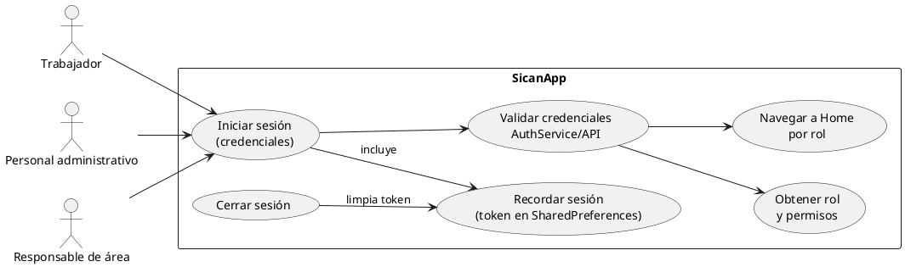
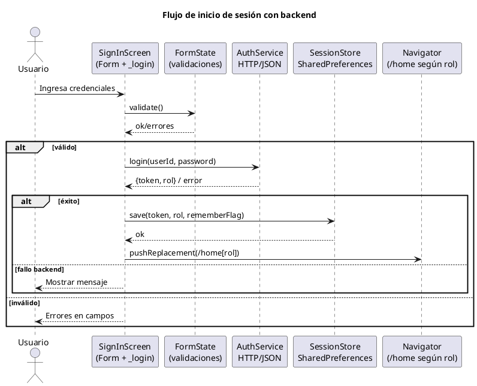
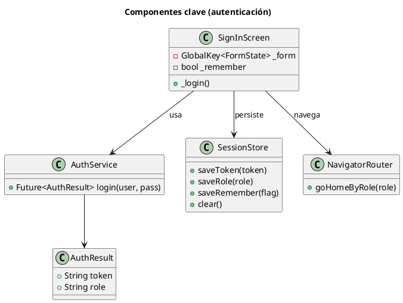

# UML de Autenticación (RF-01)

Requerimiento: El sistema permite inicio de sesión con credenciales de personal sindicalizado (trabajador, administrativo, responsable de área), protegiendo información y diferenciando roles.

## Casos de uso

## Secuencia de inicio de sesión

## Vista de clases/responsabilidades

